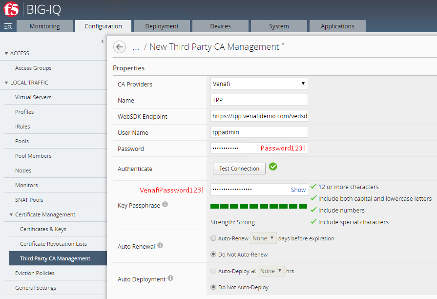
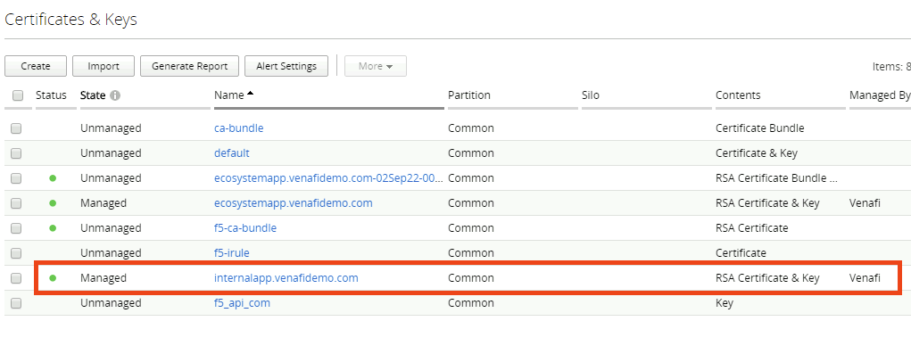

# **The Lab Environment**

This Venafi Trust Protection Platform lab environment contains the following virtual machines that have been pre-configured with the proper networking and settings. The environment includes:

- **1x Trust Protection Platform Server (TPP 20.2)**
  - Microsoft Certification Authority (venafidemo-TPP-CA)
  - Active Directory Domain Services (venafidemo.com)
  - DNS (venafidemo.com)
  - IIS Server (for Venafi GUIs)
  - MS SQL Express 2016
- **1x Ubuntu Server (Apache)**
  - Minimal Install
  - Apache Web Server
- **1x F5 BIG-IP Server (BIG-IP)**
- **1x F5 BIG-IQ Server (BIG-IQ)**

___

| VM | Internal IP | Internal DNS  |  CLI Username | CLI Password |  GUI Username | GUI Password |
| ----------- | ----------- | ----------- | ----------- | ----------- | ----------- | ----------- |
| BIG-IQ | 192.168.1.200 | bigiq.venafidemo.com | root | VenP@ss123! | admin | VenP@ss123!
| BIG-IP | 192.168.1.201 | bigip1.venafidemo.com | root | VenP@ss | admin | VenP@ss
| TPP Server | 192.168.1.100 | tpp.venafidemo.com | N/A | N/A | VENAFIDEMO\venafi_svc | 5&Njgx8IGyHQ
| Venafi Platform | 192.168.1.100 | tpp.venafidemo.com | N/A | N/A |  tppadmin | Passw0rd123! |
___

## **About This Lab**

- [**Section 1**](#section-1-automating-machine-identities-with-big-ip) - Automating Machine Identities with BIG-IP
- [**Section 2**](#section-2-transitioning-from-big-ip-to-big-iq) - Transitioning from BIG-IP to BIG-IQ
- [**Section 3**](#section-3-deploying-a-new-application-using-big-iq-and-venafi) - Deploying a new application using BIG-IQ & Venafi

## **Lab Steps**

### Section 0 - Verify & Refresh the Lab Environment

The BIG-IQ virtual machine sometimes has issues when resuming from a suspended state. The following steps will ensure all devices and services are working as expected, verify all settings are correct and demonstrate the current configuration of the environment.

1. Click **View VM** on *BIG-IQ.*
2. Click inside the black window and press `Enter` on the keyboard to wake up the CLI.
3. Restart BIG-IQ by typing the following command and waiting for services to come back (about 5 minutes). If you are required to login, please use the following credentials:

    ```bash
    login: root
    password: VenP@ss123!
    -----------
    reboot now
    ```

4. Click View VM on “Venafi TPP Server” and log into Windows using the following credentials, if prompted:

    ```bash
    UN: VENAFIDEMO/Administrator
    PW: Password123!
    ```

6. Next, validate the current BIG-IP configuration by opening the “BIG-IP #1” bookmark and logging in with the following credentials:

    ```bash
    UN: admin
    PW: VenP@ss
    ```

    > **NOTE:** The management certificate for BIG-IP is also being managed by TPP. The management certificate for BIG-IQ will be self-signed.

### Section 1: Automating Machine Identities with BIG-IP

An Apache web server has already been configured in the environment and is hosting a static, example application. This section will walk through the configuration of an F5 BIG-IP device providing SSL termination to that application while using a machine identity from Venafi Trust Protection Platform.

#### Configure BIG-IP

1. Login to the Trust Protection Platform server, open a browser and navigate to <http://ubuntu-web> to verify the application is up and running. The Venafi Ecosystem background should be visible.

2. Next, navigate to <https://bigip1.venafidemo.com> from within the TPP VM to start the configuration of BIG-IP. Login with the following credentials:

    ```bash
    UN: admin
    PW: VenP@ss
    ```

3. Click on `Local Traffic > Nodes` and then the `Create` button to create a new Node.

    

4. Fill in the node information as follows:

    ```json
    "Name": "ecosystemapp"
    "Address": 192.168.2.101
    ```

    

5. Navigate to `Local Traffic > Pools` and click the `Create` button to create a new Pool

6. Use the following values to create the new pool:

    ```json
    "Name": "ecosystemapp_pool"
    "Service Port": 80
    ```

    > **NOTE:** Make sure to click the `Add` button after specifying the port:
    > 

7. Click `Finished` to create the new pool

8. Navigate to `Local Traffic > Virtual Servers` and click the `Create` button to create a new Virtual Server

9. Use the following values to create the virtual server:

    ```json
    "Name": "vs_ecosystem"
    "Source Address": 0.0.0.0/0
    "Destination Address": 192.168.2.10
    "Service Port": "https"
    "SSL Profile (Client)": "clientssl"
    "Source Address Translation": "Auto Map"
    "Default Pool": "ecosystemapp_pool"
    ```

    
    
    

10. At this point, BIG-IP is hosting the ecosystemapp application at the virtual IP <https://192.168.2.10>, but the application is not using a valid certificate yet.

#### Configure Venafi

> **NOTE:** A BIG-IP Credential Object has already been created in TPP using the BIG-IP credentials from earlier in the lab:
> 

1. Log into Web Admin using the **Venafi TPP** bookmark in the Chrome bookmark toolbar:

    

2. Navigate to `Policy > Certificates > F5 > BIG-IP > bigip1.venafidemo.com`. A BIG-IP Device Object has already been created in TPP using the FQDN and specifying a Credential Object that can be used for authentication to the BIG-IP device.

    

    > **NOTE:** An F5 Application Object has already been created and is currently managing the BIG-IP device certificate. A new Application Object will be created to manage the machine identity associated with the ecosystemapp application.

3. Right-click the `bigip1.venafidemo.com` Device Object and then click `Add > Certificates > Server Certificate` and enter the following information:

    ```json
    "Certificate Name": "ecosystemapp.venafidemo.com"
    "Common Name": "ecosystemapp.venafidemo.com"
    "Organization": "Venafi"
    "Organization Unit": "Ecosystem"
    "City": "Salt Lake City"
    "State/Province": "UT"
    "Country" : "US"
    ```

    

4. Click `Save` at the bottom of the page

5. The Certificate Object has been created, but it hasn't been issued by the CA yet. Click `Renew Now` to issue the certificate.

    

6. Venafi Trust Protection Platform will submit the CSR to the configured Certificate Authority and retrieve it when it becomes available. This process can be seen by clicking on the `Refresh` icon in the top-right corner. Keep clicking on `Refresh` until the **Certificate Status** says `OK`.

    

7. Right-click the `bigip1.venafidemo.com` Device Object and then click `Add > Application > F5 LTM Advanced` and configure the Application Object with the following information:

    ```json
    "Processing Disabled": □
    "Associated Certificate": "ecosystemapp.venafidemo.com"
    "Application Name": "ecosystemapp"
    "Force Profile Update": "Yes"
    "Bundle Certificate": "Yes"
    "Overwrite Certificate and Key": "Yes"
    "SSL Profile": "client_tpp"
    "Parent SSL Profile": "clientssl"
    "Virtual Server": "vs_ecosystem"
    "Virtual Server Partition": "Common"
    ```

    
    
    > **NOTE:** This example will create a new `client_tpp` SSL Profile if it doesn't already exist, using the **Parent SSL Profile** information.

8. Click `Save` at the bottom of the page.

9. Click `Push` to automatically provision the associated certificate to BIG-IP, create the new "client_tpp" SSL Profile and assign it to the "vs_ecosystem" Virtual Server. This process can be seen by clicking on the `Refresh` icon in the top-right corner. Keep clicking on `Refresh` until the **Certificate Status** says `OK`.

    

10. Verify the certificate is in use by the virtual server by navigating to the Virtual Server IP address at <https://192.168.2.10> or <https://ecosystemapp.venafidemo.com> and using the browser to inspect the certificate. The issue date should be today's date.

### Section 2: Transitioning from BIG-IP to BIG-IQ

The steps in this section will bring the BIG-IP server under the management of BIG-IQ. All future lifecycle operations involving the machine identity will be initiated from BIG-IQ. The BIG-IQ virtual machine sometimes has issues when resuming from a suspended state. 

**If the VM wasn't reset in the previous section, or if the environment has suspended and resumed since then, the following steps will ensure all devices and services are working as expected.**

1. Click **View VM** on *BIG-IQ.*
2. Click inside the black window and press `Enter` on the keyboard to wake up the CLI.
3. Restart BIG-IQ by typing the following command and waiting for services to come back (about 5 minutes):

    ```bash
    reboot now
    ```

    > **NOTE:** You should see the BIG-IQ Login Screen when the device has finished starting up:
    > 

#### **Configure BIG-IQ**

1. Navigate to the “BIG-IQ” bookmark and login with the following credentials:

    ```bash
    UN: admin
    PW: VenP@ss123!
    ```

2. Click on the **Devices** tab and then click **Add Device** and enter the following information, then click **Add**.

    ```json
    "IP Address": 192.168.1.201
    "Port": 443
    "User Name": "admin"
    "Password": "VenP@ss"
    ```

    

3. Leave the default “Local Traffic (LTM)” selected and click Continue. When complete, bigip1.venafidemo.com should be listed in the device list.

    

4. Click on **Complete Import** Tasks in the “Services” column and then the **Import** button to import the current configuration of the BIG-IP device added in the previous step.

5. Click the **Configuration** tab, then `Local Traffic > Certificate Management > Certificates & Keys`. The certificate created in Section 1, "ecosystemapp.venafidemo.com" is present and listed as "Unmanaged."

    

6. Next, click **Third Party CA Management**, then **Create** to configure TPP as a CA provider using the following values, and then click **Test Connection** to validate.

    ```json
    "CA Providers": "Venafi"
    "Name": "TPP"
    "WebSDK Endpoint": "https://tpp.venafidemo.com/vedsdk"
    "User Name": "tppadmin"
    "Password": "Password123!"
    "Key Passphrase": "VenafiPassword123!"
    ```

    

    > **NOTE:** In order for the above step to complete successfully in production environments, the Venafi Operational Certificate must be publicly trusted, OR the root certificate of the internal CA must be added to the Java trust store on BIG-IQ.

7. Before continuing with the BIG-IQ configuration, users will want to configure TPP with a logical BIG-IQ policy folder structure. Navigate back to Web Admin and create the following two new Policy folders under the existing BIG-IQ folder. These newly created folders will be used in steps later in the lab. For this example, the `Ecosystem App` folder will be used for our existing application. The `Internal App` folder will be used to demonstrate additional policy options that can be enforced by Venafi Trust Protection Platform.

8. Right-click the `BIG-IQ` folder, select `Add > Policy`, name it **"Ecosystem App,"** and configure the policy with the following settings, ensuring to lock the policy values. Be sure to click **Save** at the bottom of the page to save the configuration settings.

    ```json
    "Organization": "Venafi"
    "Organization Unit": "Ecosystem"
    "City": "Salt Lake City"
    "State/Province": "UT"
    "Country": "US"
    ```

    

9. Right-click the `BIG-IQ` folder, select `Add > Policy`, name it **"Internal App,"** and configure the policy with the following settings, ensuring to lock the Orgnazation and Country fields. Be sure to click **Save** at the bottom of the page to save the configuration settings.

    ```json
    "Organization": "Venafi"
    "Organization Unit":
    "City":
    "State/Province":
    "Country": "US"
    ```

    

10. Since BIG-IP will be handling the provisioning process, the Management Type of the BIG-IQ parent folder needs to be set to Enrollment, and child folders should be set to inherit this policy value.

11. Next, navigate back to the BIG-IQ interface and complete the configuration of the Third-Party CA Management Provider, TPP, created earlier. From the Third-Party CA Management page, click **Edit Policy**.

12. Enter `\VED\Policy\Certificates\F5\BIG-IQ\` to specify the top-level folder that should be connected to BIG-IQ and then click **Get**. The `Device Folder Path` can be left with the default value.

    

    > **NOTE:** The two policy folders created earlier should populate under the Policy Folder List

13. Click **Save & Close** at the bottom of the page.

#### **Migrate Application**

This use case outlines the steps necessary to introduce BIG-IQ to an existing environment that includes Venafi and BIG-IP. Because BIG-IQ is going to be handling the provisioning process from this point forward, the easiest thing to do is use BIG-IQ to issue a new machine identity for the application, directly from BIG-IQ. Exactly when will depend on your particular use case - the transition can take place anytime before the original certificate expires.

1. Navigate to `Configuration > Local Traffic > Certificates & Keys` and click **Create** and fill in the details for the new certificate:

    ```json
    "Name": "ecosystemapp.venafidemo.com"
    "Issuer": "TPP"
    "Policy Folder": "Ecosystem App"
    "Common Name": "ecosystemapp.venafidemo.com"
    "Password": "VenafiPassword123!"
    "Confirm Password": "VenafiPassword123!"

    ```

    

2. Click **Save & Close** to instruct BIG-IQ to create the CSR and request the certificate through Venafi Trust Protection Platform. Once the certificate has been retrieved from the Venafi platform, it should be listed on the `Certificate Management > Certificates & Keys` page, with a state of "Managed."

    

3. Next, we must update the SSL Profile with the new password for the private key. Navigate to `Configuration > Local Traffic > Profiles` and click on the **clientssl_tpp** profile to edit it.

4. Scroll down the page, select a the newly created certificate and key, and enter the private key password (`Password123!`) used in Step 1 of this exercise and then click **Save & Close**

    

5. Finally, the changes must be pushed down to the BIG-IP device – this is done using a “Deployment” from the BIG-IQ interface. Navigate to `Configuration > Local Traffic > Virtual Servers`

6. Select the “vs_ecosystem” Virtual Server and click **Deploy**

7. Give the deployment job a descriptive name, like “ecosystemapp-deployment”

8. Scroll down and ensure “vs_ecosystem” is selected as the Source Object:

9. Next, click **Find Relevant Devices**, in the bottom-left corner, to search for any BIG-IP devices that this can be deployed to – bigip1.venafidemo.com should be the only device listed. Select it and then click the arrow to move it into the “Selected” column. The final configuration should look like this:

    

10. When the target device has been selected, the Create button will become available. Click **Create** to create an “Evaluation.” Once the evaluation has been created, users are able to click View in the “Differences” column to see exactly what will change when the new deployment is pushed down to the BIG-IP device.

11. Finally, scroll to the bottom and click **Deploy Now**.

12. Navigate back to https://ecocsystemapp.venafidemo.com and inspect the certificate. The virtual server should now be using the latest certificate that was requested via BIG-IQ. 

### Section 3: Deploying a new application using BIG-IQ and Venafi

This use case outlines the steps necessary to request a new certificate from BIG-IQ, and create a new SSL Profile. There are a lot fewer steps in this section because this demonstrates a net new application. There is nothing to migrate. In this example, like the last, BIG-IQ is authoritative over the certificate lifecycle and all provisioning tasks originate from BIG-IQ, rather than Trust Protection Platform.

1. From the BIG-IQ management interface, click the **Configuration** tab and then navigate to `Local Traffic > Certificate Management > Certificates & Keys`

2. Click **Create** and fill in the details for the new certificate. You'll notice that the certificate policy for this folder is a little more relaxed due to the configurations we made in Section 2. You can choose to enter your city & state, or simply leave the fields blank.

    ```json
    "Name": "ecosystemapp.venafidemo.com"
    "Issuer": "TPP"
    "Policy Folder": "Internal App"
    "Common Name": "ecosystemapp.venafidemo.com"
    "Password": "VenafiPassword123!"
    "Confirm Password": "VenafiPassword123!"

    ```

    

3. Click **Save & Close** to begin the issuance process. The page that follows should show a new “Managed” certificate and values will continue to populate as that certificate goes through the lifecycle. When processing is complete, the status should turn to green:

    

4. Finally, navigate back to TPP and verify that the certificate object has been created and it is located in the proper folder, and with the correct settings.

    

5. At this point, users should be ready to associate the newly created certificate with a new SSL Profile using BIG-IQ.

***

**This concludes the guided lab, but please feel free to continue exploring the environment, requesting certificates and attaching them to SSL Profiles, creating virtual servers, or anything else you may want to try.**

**If you have any questions or feedback, please reach out to paul.cleary@venafi.com**
